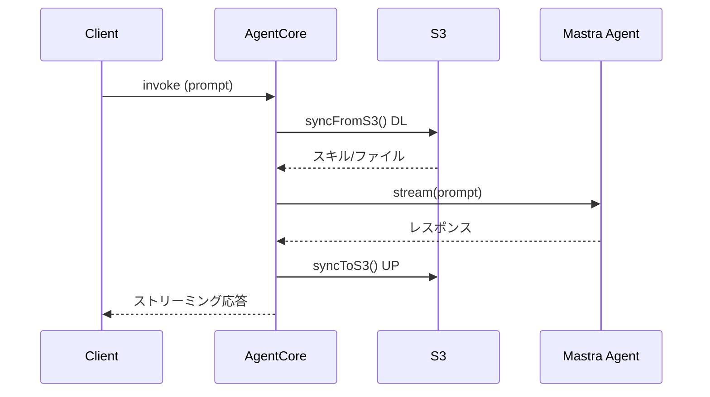

# mastra-skills-agentcore

AWS Bedrock AgentCore上で動作するMastraエージェント。[GenU](https://github.com/aws-samples/generative-ai-use-cases)で使用することができます。

## フォルダ構成

```
/
├── bin/app.ts                  # CDKエントリポイント
├── lib/agentcore-stack.ts      # CDKスタック（ECR + AgentCore Runtime + S3 + IAM）
├── s3/                         # デプロイ前・ローカルテスト用のS3同期フォルダ
├── agent/                     # Mastraエージェント一式
│   ├── src/
│   │   ├── agentcore.ts        # AgentCore サーバー（エントリポイント）
│   │   ├── logger.ts           # pinoによるLoggerのラッパー
│   │   ├── hooks/
│   │   │   └── s3-sync.ts      # S3双方向同期モジュール
│   │   └── mastra/
│   │       ├── index.ts        # Mastra インスタンス定義
│   │       ├── agents/         # エージェント定義
│   │       ├── tools/          # ツール定義
│   │       ├── workflows/      # ワークフロー定義
│   │       ├── scorers/        # スコアラー定義
│   │       └── public/         # ローカル開発用workspace（スキル領域）
│   ├── Dockerfile              # コンテナイメージ定義（マルチステージビルド）
│   └── package.json            # Mastra依存関係
├── package.json                # CDK依存関係
├── cdk.json                    # CDK設定
└── tsconfig.json               # CDK TypeScript設定
```

## スキルの追加方法

### ローカル開発用

`npm run dev:mastra` でMastra Studioを開き、GUI経由で追加することも可能です。

もしくは、`agent/src/mastra/public/workspace/.agents/skills` にスキルを追加してください。

### AgentCore Runtime 用

`s3/workspace/.agents/skills` にスキルを追加してください。
デプロイ時にS3にアップされます。

AgentCore invoke時に `s3-sync.ts` により双方向同期されます：
- **invoke前**: S3 → コンテナ内workspace（スキルDL）
- **invoke後**: コンテナ内workspace/outputs → S3（変更ファイルUP）




### デプロイ

### 前提条件

- AWS CLI 設定済み（ `aws configure` または `aws login` ）
- CDK Bootstrap 済み（初回のみ）

```shell
# 初回のみ
npx cdk bootstrap
```

### デプロイ実行

```shell
npm run cdk:deploy
```

### その他のCDKコマンド

```shell
# テンプレート確認
npm run cdk:synth

# 削除
npm run cdk:destroy
```

## デプロイ済みエージェントのテスト

`cdk deploy` 完了後に出力される `RuntimeArn` を使って直接呼び出せます。

### エンドポイントの呼び出し

```shell
# ARNを環境変数に設定
export RUNTIME_ARN=<cdk deployで出力されたRuntimeArn>

# テスト実行（簡易形式: { prompt: string }）
npm run test:invoke

# プロンプトを引数で指定
npm run test:invoke "pptxファイル作って"

# GenU形式で呼び出し（--genu オプション）
npm run test:invoke -- --genu "何ができる？"
npm run test:invoke -- --genu "pptxファイル作って"
```

### GenU互換の入出力形式

このAgentCoreは簡易形式とGenU（generative-ai-use-cases）形式の**両方**に対応しています。

| | 簡易形式 | GenU形式 |
|---|---|---|
| **入力判定** | `prompt` が文字列 | `messages` 配列が存在、または `prompt` が配列形式 |
| **入力例** | `{ "prompt": "質問" }` | `{ "messages": [{"role":"user","content":[{"text":"履歴"}]}], "prompt": [{"text":"最新の質問"}] }`<br>または<br>`{ "prompt": [{"text":"質問"}] }` |
| **出力形式** | `{ "text": "回答" }` | `{ "event": { "contentBlockDelta": { "delta": { "text": "回答" }, "contentBlockIndex": 0 } } }` |

## AgentCore サーバーのローカルテスト

```shell
# skillsをDLするため、S3バケット名を環境変数に設定
export SKILLS_BUCKET_NAME=<cdk deployで出力されたSkillsBucketName>

# AgentCoreサーバーのローカル起動（ルートディレクトリから実行）
npm run dev:agentcore
```

別ターミナルからテスト:

```shell
# 簡易形式: promptが文字列
curl -X POST http://127.0.0.1:8080/invocations \
  -H "Content-Type: application/json" \
  -H "Accept: text/event-stream" \
  -d '{"sessionId": "test-session-1", "prompt": "何ができる？"}'


# GenU形式: prompt配列のみ
curl -X POST http://127.0.0.1:8080/invocations \
  -H "Content-Type: application/json" \
  -H "Accept: text/event-stream" \
  -d '{"sessionId": "test-session-2", "prompt": [{"text": "何ができる？"}]}'

# GenU形式: messages（過去の会話履歴） + prompt（最新の質問）の組み合わせ
curl -X POST http://127.0.0.1:8080/invocations \
  -H "Content-Type: application/json" \
  -H "Accept: text/event-stream" \
  -d '{
  "sessionId": "test-session-3",
  "messages": [
    { "role": "user", "content": [{"text": "私の名前は太郎です。"}] },
    { "role": "assistant", "content": [{"text": "はいわかりました。"}] }
  ],
  "prompt": [{"text": "私の名前を覚えていますか"}]
}'

```

## Mastra Studio（開発用）

```shell
npm run dev:mastra
# http://localhost:4111 でUIが開きます
```

---

# Thanks to
  - [ren8k/aws-bedrock-agentcore-remote-mcp](https://github.com/ren8k/aws-bedrock-agentcore-remote-mcp)
  - [ついにAgentCoreランタイムにTypeScript SDKが対応🔥🔥 Mastraで試してみた](https://qiita.com/minorun365/items/1907d54e51f939e61bad#%E5%91%BC%E3%81%B3%E5%87%BA%E3%81%97%E3%81%A6%E3%81%BF%E3%82%88%E3%81%86)
  - [AI エージェントのファイル操作を最適化する 〜 Strands Hooks による自動同期 〜](https://zenn.dev/gawa/articles/strands-hooks-file-sync)